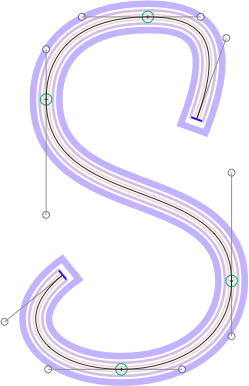

# OffsetPreview.glyphsReporter

This is a plugin for the [Glyphs font editor](http://glyphsapp.com/) by Georg Seifert.
It calculates the *GlyphsFilterOffsetCurve* parameters in active instances for the given glyph and draws those instances behind your paths. It quietly adds extremum and inflection nodes to your preview outlines. But it does not give you a full preview of the final instance, because it does not show the effect of any other parameters. It is focused on helping you spot path offset problems.

By default, it draws all active instances on top of each other using a semitransparent color, changing its hue from instance to instance:

After installation, it will add the menu item *View > Show OffsetCurve Parameter Preview*. You can set a keyboard shortcut in System Preferences.

### Installation

1. Download the complete ZIP file and unpack it, or clone the repository.
2. Double click the .glyphsReporter file. Confirm the dialog that appears in Glyphs.
3. Restart Glyphs

### Usage Instructions

1. Open a glyph in Edit View.
2. Use *View > Show OffsetCurve Parameter* to toggle the preview of the instances.

### Requirements

The plugin needs Glyphs 1.4.3 or higher, running on OS X 10.7 or later. I can only test it in current OS versions, and I assume it will not work in versions of Mac OS X older than 10.7.

### License

Copyright 2014 Rainer Erich Scheichelbauer (@mekkablue).
Based on sample code by Georg Seifert (@schriftgestalt).

Licensed under the Apache License, Version 2.0 (the "License");
you may not use this file except in compliance with the License.
You may obtain a copy of the License at

http://www.apache.org/licenses/LICENSE-2.0

See the License file included in this repository for further details.
